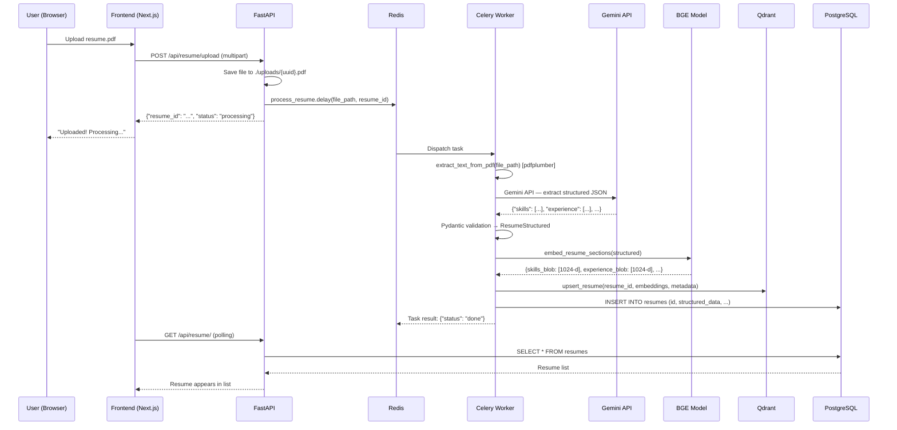
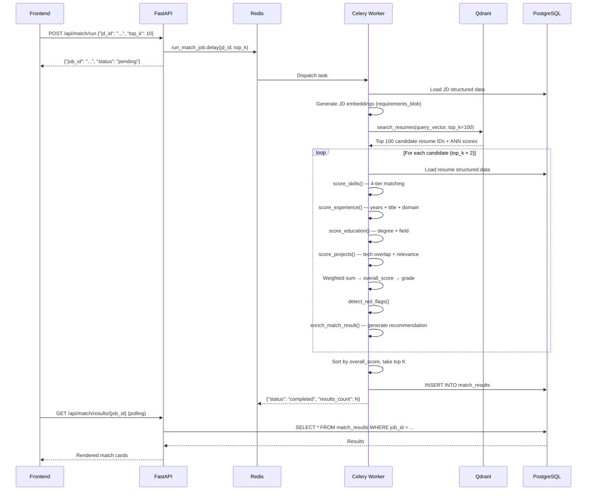
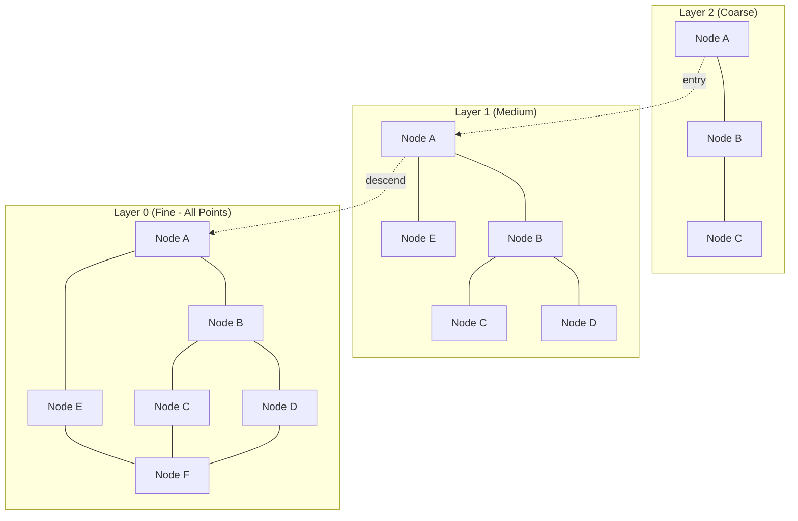
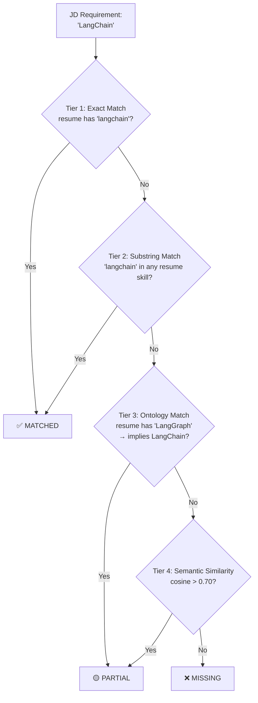
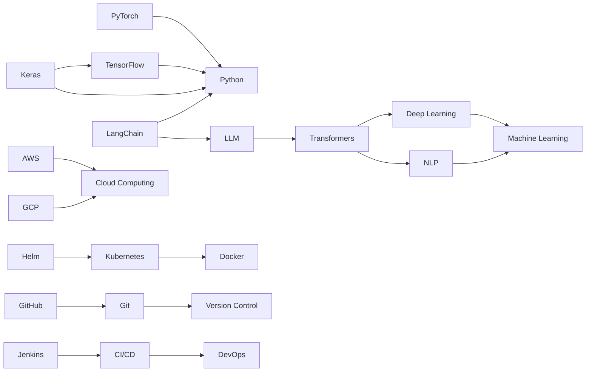
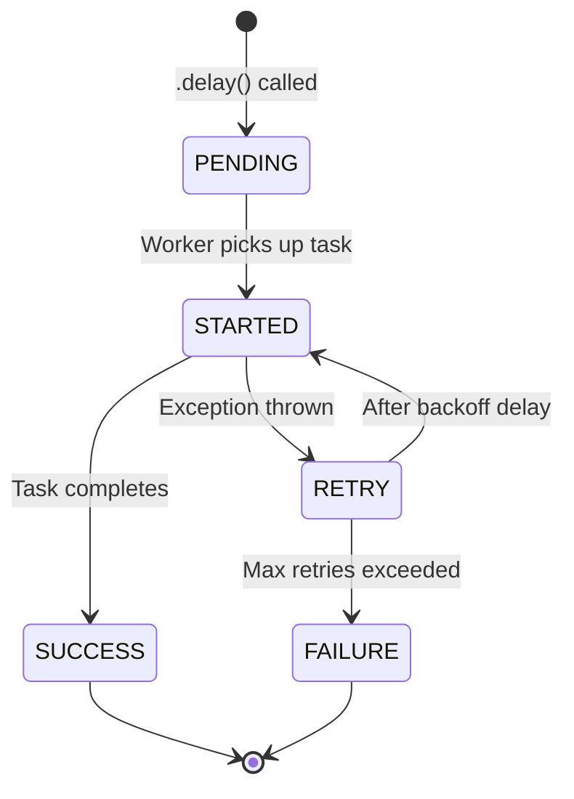

# Resume & JD Analyzer — Complete Technical Deep-Dive

> **Purpose of this document:** Give you total mastery of every layer — the architecture, the math, the data flow, and the reasoning behind each design decision — so you can build, debug, and defend this project in any interview.

---

## Table of Contents

1. [System Architecture](#1-system-architecture)
2. [Data Flow — End to End](#2-data-flow--end-to-end)
3. [Layer 1: Extraction Engine](#3-layer-1-extraction-engine)
4. [Layer 2: Embedding Engine](#4-layer-2-embedding-engine)
5. [Layer 3: Vector Store (Qdrant)](#5-layer-3-vector-store-qdrant)
6. [Layer 4: Scoring Engine](#6-layer-4-scoring-engine)
7. [Layer 4b: Skill Ontology Graph](#7-layer-4b-skill-ontology-graph)
8. [Layer 5: Explainability Engine](#8-layer-5-explainability-engine)
9. [Infrastructure: Celery + Redis + PostgreSQL](#9-infrastructure-celery--redis--postgresql)
10. [Frontend Architecture](#10-frontend-architecture)
11. [Mathematical Foundations](#11-mathematical-foundations)
12. [Interview Questions & Model Answers](#12-interview-questions--model-answers)

---

## 1. System Architecture

### High-Level Architecture Diagram

```mermaid
graph TB
    subgraph "Frontend (Next.js 16)"
        UI["React UI<br/>localhost:3000"]
    end

    subgraph "API Layer (FastAPI)"
        API["FastAPI Server<br/>localhost:8000"]
        R1["/api/resume/upload"]
        R2["/api/jd/upload"]
        R3["/api/match/run"]
        R4["/api/match/results/{id}"]
        API --> R1 & R2 & R3 & R4
    end

    subgraph "Async Workers (Celery)"
        CW["Celery Worker<br/>pool=solo"]
        T1["process_resume"]
        T2["process_jd"]
        T3["run_match_job"]
        CW --> T1 & T2 & T3
    end

    subgraph "Processing Pipeline"
        L1["Layer 1: Extractor<br/>(Gemini LLM)"]
        L2["Layer 2: Embedder<br/>(BGE-large-en)"]
        L3["Layer 3: Vector Store<br/>(Qdrant)"]
        L4["Layer 4: Scorer<br/>(Weighted Multi-Section)"]
        L4b["Layer 4b: Ontology<br/>(NetworkX DiGraph)"]
        L5["Layer 5: Explainer<br/>(Template + LLM)"]
    end

    subgraph "Data Stores"
        PG["PostgreSQL<br/>port 5433"]
        QD["Qdrant<br/>port 6333"]
        RD["Redis<br/>port 6379"]
    end

    UI -->|HTTP REST| API
    R1 & R2 -->|.delay()| RD
    RD -->|task dispatch| CW
    T1 & T2 --> L1 --> L2 --> L3
    T3 --> L4 --> L4b
    T3 --> L5
    L3 -->|vectors| QD
    T1 & T2 & T3 -->|metadata/results| PG
    R4 -->|poll| PG
```

### Component Summary Table

| Component | Technology | Role | Port |
|-----------|-----------|------|------|
| **Frontend** | Next.js 16 + React | Upload UI, results dashboard | 3000 |
| **API** | FastAPI + Uvicorn | REST endpoints, file upload, async job dispatch | 8000 |
| **Task Queue** | Celery 5.4 | Async processing of heavy ML workloads | — |
| **Message Broker** | Redis 7 | Celery task queue (broker) + result backend | 6379 |
| **Vector DB** | Qdrant | HNSW-indexed vector similarity search | 6333 |
| **Relational DB** | PostgreSQL 15 | Structured metadata, match results | 5433 |
| **LLM** | Google Gemini 2.5 Flash | Resume/JD text → structured JSON extraction | — |
| **Embedding Model** | BAAI/bge-large-en-v1.5 | 1024-dim dense vectors for semantic search | — |

---

## 2. Data Flow — End to End

### Resume Upload Flow



### Match Flow



---

## 3. Layer 1: Extraction Engine

**File:** [extractor.py](file:///c:/Users/pguru/Desktop/resume_analyzer/backend/core/extractor.py)

### What it does
Converts raw unstructured text (from PDF/DOCX/TXT) into validated Pydantic models using Google Gemini.

### Pipeline

```
PDF/DOCX/TXT → pdfplumber/python-docx → raw text → Gemini API → JSON → Pydantic validation → ResumeStructured/JDStructured
```

### Key Design Decisions

| Decision | Why |
|----------|-----|
| **`response_mime_type="application/json"`** | Forces Gemini to output valid JSON natively, eliminating the need for regex fence-stripping |
| **`max_output_tokens=8192`** | Prevents JSON truncation for large resumes/JDs with many skills |
| **SHA256 content-hash caching** | Same resume text → same extraction result, saving API calls |
| **Text truncated to 8000 chars** | Gemini has input token limits; resumes rarely exceed 8K chars of meaningful content |
| **Atomic skill extraction prompt** | Forces LLM to output `"Python"`, `"Docker"` instead of `"Cloud & MLOps (AWS, GCP)"` |

### Pydantic Schema — ResumeStructured

```python
class ResumeStructured:
    raw_text: str
    skills: List[Skill]            # [{name, years, recency, proficiency}]
    experience: List[Experience]   # [{title, company, duration_months, ...}]
    education: List[Education]     # [{degree, field, institution, ...}]
    projects: List[Project]        # [{name, description, technologies, ...}]
    certifications: List[str]
    total_experience_months: int
    domains: List[str]             # ["fintech", "healthtech", ...]
```

### Pydantic Schema — JDStructured

```python
class JDStructured:
    raw_text: str
    title: str                                # "Senior AI Engineer"
    level: Optional[Literal[...]]             # intern|junior|mid|senior|lead|principal
    requirements: List[JDRequirement]         # [{skill, is_required, min_years}]
    preferred_skills: List[str]
    domain: str
    responsibilities: List[str]
    min_experience_years: Optional[float]
    education_requirement: Optional[str]
```

---

## 4. Layer 2: Embedding Engine

**File:** [embedder.py](file:///c:/Users/pguru/Desktop/resume_analyzer/backend/core/embedder.py)

### What it does
Converts text sections into 1024-dimensional dense vectors using the **BAAI/bge-large-en-v1.5** sentence transformer model.

### The Model: BGE-large-en-v1.5

| Property | Value |
|----------|-------|
| **Architecture** | BERT-based bi-encoder |
| **Dimensions** | 1024 |
| **Max sequence** | 512 tokens |
| **Training** | Contrastive learning on large-scale text pairs |
| **Size** | ~1.3 GB |
| **Key feature** | Asymmetric retrieval with query prefix |

### Asymmetric Retrieval — Why the Query Prefix Matters

BGE was trained with a **query-passage asymmetry**:
- **Passages** (resume content): Embedded as-is — `"Python, Docker, Kubernetes"`
- **Queries** (JD requirements): Prepended with `"Represent this sentence for searching relevant passages: "` — this shifts the embedding into "search mode"

This is critical because the same text means different things depending on context. A JD listing "Python required" is a **query** looking for candidates; a resume listing "Proficient in Python" is a **passage** to be found.

### Section-Level Embedding (Not Whole-Document)

Instead of embedding the entire resume as one blob, we embed **5 separate sections**:

| Section | Content | Purpose |
|---------|---------|---------|
| `skills_blob` | `"Skills: Python, Docker, K8s, ..."` | Direct skill matching |
| `experience_blob` | `"AI Engineer at Google: built RAG pipeline..."` | Role relevance |
| `education_blob` | `"B.Tech in Computer Science"` | Education matching |
| `projects_blob` | `"LLM Chatbot: Built using LangChain..."` | Project relevance |
| `full_profile` | Truncated raw text (first 2000 chars) | Fallback/holistic |

**Why section-level?** Whole-document embeddings dilute signal. A resume with 20 Python projects but 1 line about cooking would have its Python signal weakened if embedded as one blob. Section-level keeps each signal concentrated.

### L2 Normalization

Every vector is L2-normalized: `v̂ = v / ||v||₂`

This means:
- `||v̂||₂ = 1` (unit vector)
- **Cosine similarity = Dot product** (since both vectors have unit length)
- Qdrant can use `Distance.COSINE` efficiently

### Caching

Embeddings are cached by SHA256 hash of the input text. If you re-upload the same resume, no GPU/CPU cycles are wasted on re-embedding.

---

## 5. Layer 3: Vector Store (Qdrant)

**File:** [vector_store.py](file:///c:/Users/pguru/Desktop/resume_analyzer/backend/core/vector_store.py)

### What it does
Stores and retrieves dense vector embeddings using Qdrant, a purpose-built vector database.

### Collections

| Collection | Stores | Vector Size | Points per Document |
|------------|--------|-------------|---------------------|
| `resumes` | Resume section embeddings | 1024 | 5 (one per section) |
| `job_descriptions` | JD section embeddings | 1024 | 3 (requirements, responsibilities, full_profile) |

### HNSW Index — The Data Structure Behind Fast Search

Qdrant uses **HNSW (Hierarchical Navigable Small World)** graphs for approximate nearest neighbor (ANN) search.

```
Configuration:
  m = 16           # Each node connects to 16 neighbors per layer
  ef_construct = 100  # Candidates explored during index building
  Distance = COSINE
```

#### How HNSW Works (Simplified)



**Search algorithm:**
1. Start at the top layer (fewest nodes, coarsest)
2. Greedily walk to the nearest neighbor at that layer
3. Drop down to the next layer and repeat
4. At the bottom layer (all points), do a more thorough local search

**Complexity:** `O(log N)` instead of brute-force `O(N)` — this is how Qdrant searches millions of vectors in milliseconds.

#### Trade-offs

| Parameter | ↑ Higher | ↓ Lower |
|-----------|----------|---------|
| `m` | Better recall, more memory | Faster build, less memory |
| `ef_construct` | Better index quality | Faster build time |

### Payload Filtering

Each vector point carries a **payload** (metadata):

```json
{
    "resume_id": "uuid",
    "section_type": "skills_blob",
    "domains": ["AI/ML", "fintech"],
    "total_experience_months": 48,
    "upload_date": "2026-05-27T..."
}
```

Qdrant supports **pre-filtering** — it filters by payload conditions BEFORE running the ANN search, not after. This means `domain="fintech"` only searches fintech resumes, making it fast even with millions of vectors.

### Two-Stage Retrieval

```
Stage 1: ANN Search (Qdrant)
    Input:  JD requirements_blob embedding (1024-d)
    Output: Top 100 resume IDs + similarity scores
    Speed:  ~10ms for 100K vectors

Stage 2: Full Re-ranking (Scorer)
    Input:  Top 100 candidates
    Output: Top K results with section breakdowns
    Speed:  ~200ms per candidate (CPU embedding)
```

**Why two stages?** ANN search is cheap but imprecise (only compares one embedding). Full scoring is expensive but thorough (compares skills, experience, education, projects individually). The ANN stage acts as a **funnel** to reduce the candidate set before expensive re-ranking.

---

## 6. Layer 4: Scoring Engine

**File:** [scorer.py](file:///c:/Users/pguru/Desktop/resume_analyzer/backend/core/scorer.py)

### What it does
Computes a weighted multi-section score between a resume and a JD, producing a 0-100 overall score with letter grade.

### Scoring Formula

```
overall_score = Σ (weight_i × section_score_i) × 100
```

Where section scores are:
- `skills_score` ∈ [0, 1]
- `experience_score` ∈ [0, 1]
- `education_score` ∈ [0, 1]
- `projects_score` ∈ [0, 1]

### Weights by Role Level

| Level | Skills | Experience | Education | Projects |
|-------|--------|------------|-----------|----------|
| **Intern** | 0.25 | 0.15 | **0.35** | 0.25 |
| **Junior** | **0.35** | 0.25 | 0.20 | 0.20 |
| **Mid** | **0.40** | 0.35 | 0.15 | 0.10 |
| **Senior** | 0.35 | **0.45** | 0.10 | 0.10 |
| **Lead** | 0.30 | **0.50** | 0.10 | 0.10 |

**Design rationale:**
- **Interns**: Education matters most (they don't have experience yet)
- **Mid-level**: Skills are king — can you do the job?
- **Senior/Lead**: Experience dominates — have you done this before at scale?

### Skill Scoring — Four-Tier Matching

For each JD requirement, the scorer tries four tiers in order:



```
skill_score = (matched + 0.5 × partial) / total_requirements
```

**Example:** JD has 10 requirements. Resume matches 5 directly, 2 partially.
```
score = (5 + 0.5 × 2) / 10 = 6 / 10 = 0.60 (60%)
```

### Experience Scoring

```
experience_score = 0.4 × years_score + 0.4 × title_score + 0.2 × domain_score
```

| Component | How it's computed |
|-----------|-------------------|
| `years_score` | `min(resume_years / required_years, 1.0)` — capped at 100% |
| `title_score` | Semantic similarity between resume job titles and JD title |
| `domain_score` | 1.0 if domain matches, 0.4 if not |

### Education Scoring

```
education_score = 0.5 × degree_score + 0.5 × field_score
```

Uses a **degree hierarchy** for level comparison:
```
high school(1) < diploma(2) < associate(3) < bachelor(4) < master(5) < PhD(6)
```

If resume has `master` and JD requires `bachelor`: `degree_score = 1.0` (exceeds requirement).

### Grade Assignment

| Score Range | Grade |
|-------------|-------|
| 85–100 | **A** |
| 70–84 | **B** |
| 55–69 | **C** |
| 40–54 | **D** |
| 0–39 | **F** |

---

## 7. Layer 4b: Skill Ontology Graph

**File:** [ontology.py](file:///c:/Users/pguru/Desktop/resume_analyzer/backend/core/ontology.py)

### What it does
A directed graph where edges mean "knowing X implies capability in Y." Used for **transitive skill inference** during scoring.

### Graph Structure



### How Transitive Inference Works

**Query:** Does the resume satisfy "Machine Learning"?  
**Resume has:** PyTorch

```
Path search: PyTorch → Python (not ML)
             PyTorch → ??? 
```

Wait — there's no direct edge from PyTorch to ML in our graph. But we DO have:
```
scikit-learn → machine learning
deep learning → machine learning
```

If the resume had `deep learning`, the path would be:
```
deep learning → machine learning  ✅ (1 hop)
```

The system uses `networkx.has_path(G, source, target)` which does a **BFS/DFS traversal** to find ANY path. Complexity: `O(V + E)` where V = nodes, E = edges.

### Why Not Just Use Semantic Similarity?

Ontology gives **deterministic, explainable** matches:
- `"PyTorch" → "Python"` is a fact, not a probability
- You can show the user: *"Python (inferred from PyTorch)"*
- Semantic similarity might say PyTorch ≈ Python at 0.6 (below threshold) — a false negative

The ontology handles the **known relationships**; semantic similarity handles the **unknown ones**.

---

## 8. Layer 5: Explainability Engine

**File:** [explainer.py](file:///c:/Users/pguru/Desktop/resume_analyzer/backend/core/explainer.py)

### Two Modes

| Mode | Speed | Cost | Quality |
|------|-------|------|---------|
| **Template** (default) | Instant | Free | Deterministic, structured |
| **LLM-enhanced** | 2-5s | API call | Polished prose, contextual |

### Template Engine

Generates recommendations from match data using string templates:

```
"This candidate is {assessment} with an overall score of {score}/100 (Grade: {grade}).
 Skills alignment is strong with {N} direct match(es): {skills}.
 However, {M} required skill(s) are missing: {missing}.
 Experience: {years} years vs {required} required.
 Red flags to consider: {flags}.
 Recommendation: {action}."
```

**Why default to templates?** LLM calls cost money and add latency. For bulk matching (100 candidates), templates are instant. LLM mode is opt-in via `explainer_use_llm=True` in config.

---

## 9. Infrastructure: Celery + Redis + PostgreSQL

### Why Celery?

Resume processing takes **60-90 seconds** (LLM call + embedding model load). You can't block an HTTP request for that long. Celery runs these tasks **asynchronously** in a background worker process.

### Task Lifecycle



### Retry Strategy (autoretry_for)

```python
@celery_app.task(
    autoretry_for=(Exception,),
    retry_backoff=30,       # Base delay: 30s
    retry_backoff_max=600,  # Max delay: 10 min
    retry_jitter=True,      # Randomize to avoid thundering herd
    max_retries=5,
)
```

**Backoff sequence:** 30s → 60s → 120s → 240s → 480s (capped at 600s)

With jitter: `actual_delay = random(0, calculated_delay)` — prevents all workers from retrying at the exact same moment.

### Worker Startup: Queue Purge

```python
@worker_ready.connect
def purge_queue(sender, **kwargs):
    sender.app.control.purge()
```

**Why?** Redis persists tasks. If your worker crashed while processing 10 tasks, those 10 tasks are still in the queue. On restart, they'd all replay (possibly with stale data or exhausted API keys). Purging on startup gives a clean slate.

### PostgreSQL Schema

```mermaid
erDiagram
    RESUMES {
        string id PK
        string candidate_name
        text raw_text
        text structured_data "JSON blob"
        string file_hash UK "SHA256 dedup"
        int total_experience_months
        text domains "JSON array"
        int skills_count
        datetime created_at
    }

    JOB_DESCRIPTIONS {
        string id PK
        string title
        string level
        text raw_text
        text structured_data "JSON blob"
        string file_hash UK "SHA256 dedup"
        string domain
        int requirements_count
        datetime created_at
    }

    MATCH_RESULTS {
        string id PK
        string resume_id FK
        string jd_id FK
        float overall_score
        string grade
        text result_data "Full MatchResult JSON"
        string job_id IX "Celery task ID"
        datetime created_at
    }

    RESUMES ||--o{ MATCH_RESULTS : "matched against"
    JOB_DESCRIPTIONS ||--o{ MATCH_RESULTS : "matched against"
```

### Dual-DB Architecture

| Store | What | Why |
|-------|------|-----|
| **PostgreSQL** | Structured metadata, match results, raw text | Relational queries, ordering, filtering by job_id |
| **Qdrant** | Dense vector embeddings (1024-d) | ANN similarity search in O(log N) |

**Why not just Qdrant?** Qdrant is optimized for vector search, not relational queries like "get all match results for job X sorted by score." PostgreSQL handles that natively.

**Why not just PostgreSQL with pgvector?** pgvector works for small scale, but Qdrant's HNSW implementation is highly optimized with payload filtering, quantization, and distributed sharding. At scale, Qdrant is 10-100x faster.

---

## 10. Frontend Architecture

**Framework:** Next.js 16 with App Router (Turbopack)

### Pages

| Route | Purpose |
|-------|---------|
| `/` | Dashboard / landing page |
| `/resumes` | Upload resumes, view list |
| `/jobs` | Upload JDs, view list |
| `/match` | Run matching, view results |

### API Client

- Base URL: `http://localhost:8000`
- Timeout: 30 seconds
- Retry: Up to 3 attempts for GET requests
- Polling: After upload, polls every 2 seconds for up to 30 seconds

---

## 11. Mathematical Foundations

### Cosine Similarity

The core metric used everywhere in this system.

```
cos(A, B) = (A · B) / (||A|| × ||B||)
```

Since all vectors are L2-normalized (`||A|| = ||B|| = 1`):

```
cos(A, B) = A · B = Σ(aᵢ × bᵢ)
```

**Range:** [-1, 1] where:
- **1.0** = identical direction (perfect match)
- **0.0** = orthogonal (unrelated)
- **-1.0** = opposite direction (antonym)

**In our system**, cosine similarity typically ranges from 0.5 (weakly related) to 0.95 (near-identical).

### Why Cosine over Euclidean?

```
Euclidean:  d(A, B) = √(Σ(aᵢ - bᵢ)²)
Cosine:     cos(A, B) = Σ(aᵢ × bᵢ) / (||A|| × ||B||)
```

Cosine measures **direction**, not magnitude. Two documents about "Python programming" should be similar regardless of whether one is 500 words and the other is 5000 words. Euclidean distance would penalize the length difference.

### HNSW Complexity Analysis

| Operation | Complexity | Notes |
|-----------|-----------|-------|
| **Build index** | O(N × log(N) × M) | N=points, M=connections per layer |
| **Search** | O(log(N) × ef) | ef=search candidates (runtime param) |
| **Memory** | O(N × M × layers) | ~1KB per point for 1024-d vectors |

For 1 million vectors: search takes ~5ms. For 100 million: ~15ms. This is why HNSW is the industry standard for production vector search.

### Weighted Scoring Mathematics

```
overall = w_skills × S_skills + w_exp × S_exp + w_edu × S_edu + w_proj × S_proj
```

This is a **convex combination** (weights sum to 1.0):
```
0.40 + 0.35 + 0.15 + 0.10 = 1.00  ✓
```

Property: The overall score is guaranteed to be in [0, 1] because each section score is in [0, 1] and weights sum to 1.

### BGE Embedding Space

The BGE model maps text to a 1024-dimensional hypersphere. Key properties:

1. **Semantic clustering:** Similar concepts cluster together
   - `"Python"` and `"PyTorch"` are close (~0.75 cosine)
   - `"Python"` and `"cooking"` are far (~0.15 cosine)

2. **Compositionality:** Longer phrases have richer representations
   - `"Machine Learning"` captures the concept better than `"ML"`

3. **Query-passage asymmetry:** The prefix shifts the query embedding to align better with relevant passages in the learned space

---

## 12. Interview Questions & Model Answers

### System Design Questions

**Q1: Why did you choose a two-stage retrieval architecture (ANN → re-ranking)?**

> Stage 1 (ANN) is a cheap funnel — Qdrant searches through all vectors in O(log N) and returns the top 100 candidates based on a single embedding similarity. This is fast (~10ms) but imprecise because it only compares one vector (the JD requirements blob) against one vector (the best resume section). Stage 2 loads the full structured data for each candidate and runs a multi-section weighted scorer that considers skills, experience, education, and projects individually. This is expensive (~200ms per candidate) but thorough. The two-stage approach gives us the precision of full scoring at the speed of vector search. Without Stage 1, we'd have to score every resume in the database — O(N) per match job.

**Q2: Why separate PostgreSQL and Qdrant instead of using pgvector?**

> pgvector is great for prototyping but has limitations at scale. First, Qdrant's HNSW implementation is specifically optimized for vector operations with tunable parameters (m, ef_construct). Second, Qdrant supports payload filtering BEFORE the ANN search — pgvector does a post-filter which wastes resources. Third, we need PostgreSQL for relational queries (JOINs, ORDER BY score, filter by job_id) that don't involve vectors. Separating concerns lets each database do what it's best at.

**Q3: How would you handle 10,000 resumes uploaded at once?**

> The current architecture already supports this via Celery's `group()` primitive in `pipeline.py`. Each resume becomes an independent Celery task, and the worker processes them sequentially (solo pool). To scale: (1) increase Celery concurrency or add more workers, (2) use the prefork pool instead of solo, (3) pre-load the embedding model once at worker startup (we already do this with `_components_cache`), (4) batch the Gemini API calls where possible, and (5) consider a dedicated GPU worker for embeddings.

**Q4: What happens if the Gemini API goes down mid-processing?**

> The Celery task has `autoretry_for=(Exception,)` with exponential backoff starting at 30 seconds, capped at 10 minutes, with jitter. If Gemini returns a 429 rate limit, the task waits and retries. After 5 failed retries, the task is marked as FAILURE. The file is already saved to disk, so the user can re-trigger processing without re-uploading.

---

### ML / Embeddings Questions

**Q5: Why BAAI/bge-large-en-v1.5 instead of OpenAI embeddings?**

> Three reasons: (1) **Cost** — BGE runs locally on CPU, no API calls per embedding. At scale, embedding 10K resumes × 5 sections = 50K API calls would be expensive with OpenAI. (2) **Latency** — local inference has no network round-trip. (3) **Privacy** — resume data never leaves our servers. The trade-off is that BGE-large is 1.3GB and takes ~5 seconds to load on first use, which is why we cache it at the module level.

**Q6: What does L2 normalization do and why is it important?**

> L2 normalization projects every vector onto the unit hypersphere (||v|| = 1). This makes cosine similarity equal to the dot product: cos(A,B) = A·B when ||A||=||B||=1. This matters because (1) dot product is faster to compute than full cosine, (2) it makes Qdrant's COSINE distance mode equivalent to inner product, and (3) it ensures that document length doesn't affect similarity — a 2-page resume and a 5-page resume about the same topic will have similar vectors.

**Q7: What is the BGE query prefix and why does it matter?**

> BGE was trained with asymmetric contrastive learning. During training, queries had a specific prefix that shifts the embedding into "search mode." Without the prefix, a query like "Python experience" would be embedded as a passage (informational text). With the prefix, it's embedded as a question/search intent. In our system, JD requirements are queries (we're searching for matching resumes), and resume sections are passages (documents to be found). Using the prefix correctly improves recall by 5-10% compared to treating everything as passages.

**Q8: Why section-level embedding instead of whole-document?**

> Whole-document embedding suffers from information dilution. A resume with 20 Python skills, 5 AWS projects, but one line about "volunteered at a food bank" would have its technical signal weakened by the volunteer line. Section-level embedding keeps each signal concentrated: the skills_blob captures only skills, the experience_blob captures only work history. During ANN search, we use the `requirements_blob` to find resumes whose skill embeddings are closest — this is much more precise than comparing whole-document blobs.

---

### Scoring & Matching Questions

**Q9: Explain the four-tier skill matching strategy.**

> Tier 1 is exact case-insensitive match (resume has "python", JD requires "Python" → match). Tier 2 is substring containment (resume has "langchain", JD requires "AI Orchestration (LangChain)" → match because "langchain" is contained in the JD skill). Tier 3 is ontology inference using a directed graph — if the resume has "PyTorch" and PyTorch → Python is in our graph, then the Python requirement is partially satisfied. Tier 4 is semantic similarity — we embed both the JD skill and all resume skills, compute cosine similarity, and accept any pair above 0.70. Each tier is tried in order, and we stop at the first match to avoid double-counting.

**Q10: Why is the scoring penalty removed? Doesn't that let bad candidates score too high?**

> The base formula `(matched + 0.5 × partial) / total_requirements` already naturally reflects missing skills. If a JD has 20 requirements and the resume matches only 5, the score is 5/20 = 25%. Adding a penalty on top of this was **double-counting** — the missing skills are already absent from the numerator. The old penalty of 0.10 per missing required skill could reach 150% for a JD with 15+ requirements, driving the score to 0% even when real matches existed. The current formula is mathematically clean: 0% means zero matches, 100% means all requirements met.

**Q11: How do role-level weights work and why?**

> The weights are a convex combination (they sum to 1.0) that shifts emphasis based on career stage. For interns, education gets the highest weight (0.35) because they have no work history — their degree and GPA are the strongest signals. For senior/lead roles, experience dominates (0.45-0.50) because at that level, skills are assumed and what matters is whether you've solved similar problems at scale. The weights are stored in a lookup table and selected based on the JD's extracted `level` field.

---

### Infrastructure Questions

**Q12: Why purge the Celery queue on worker startup?**

> Redis persists messages. If the worker crashes while processing tasks, those tasks remain in the queue. On restart, they replay — but with stale context (the LLM API key might have changed, the file might have been deleted, or the quota might be exhausted). This creates "ghost loops" where failed tasks keep retrying forever. The purge gives a clean slate. The trade-off is that any legitimately pending tasks are lost, but since files are saved to disk, users can simply re-upload.

**Q13: Explain the difference between the sync and async database access patterns.**

> FastAPI runs async (non-blocking I/O), so it uses `AsyncSession` from SQLAlchemy with the `asyncpg` driver. Celery workers run sync (blocking), so they use regular `Session` with the `psycopg` driver. The Celery tasks swap the driver in the connection URL: `database_url.replace("+asyncpg", "+psycopg")`. Both connect to the same PostgreSQL database; the only difference is the Python driver used. Using async in Celery would require an event loop, which conflicts with Celery's threading model.

**Q14: How does the SHA256 file_hash prevent duplicate processing?**

> When a resume is stored, we compute `SHA256(file_bytes)` and store it in a unique column. Before inserting a new resume, we check `WHERE file_hash = ?`. If a match exists, we skip the insert. This means uploading the exact same PDF twice won't create duplicate entries in PostgreSQL or Qdrant. It's content-based deduplication, not filename-based — renaming a file doesn't bypass it.

---

### Architecture & Trade-off Questions

**Q15: What are the main bottlenecks in this system?**

> (1) **LLM extraction** — each Gemini API call takes 10-30 seconds and is rate-limited at 15 RPM on the free tier. This is the single biggest bottleneck. (2) **Embedding model loading** — BGE-large is 1.3GB and takes 5 seconds to load from disk. We mitigate this by caching at the module level so it loads once per worker process. (3) **Sequential processing** — the `solo` pool processes one task at a time. For bulk uploads, tasks queue behind each other. Solutions: prefork pool, multiple workers, or GPU acceleration for embeddings.

**Q16: If you had to redesign this for production scale, what would you change?**

> (1) Replace the free Gemini tier with a paid LLM API or self-hosted model (Llama 3, Mistral) to eliminate rate limits. (2) Move embeddings to GPU workers for 10-50x speedup. (3) Add Celery beat for scheduled tasks (e.g., re-embed stale resumes). (4) Add a caching layer (Redis) for hot match results. (5) Implement webhook callbacks instead of polling for task completion. (6) Add RBAC and multi-tenancy. (7) Deploy Qdrant in distributed mode with replication for high availability.

**Q17: How would you add real-time matching (match as soon as a resume is uploaded)?**

> Chain the Celery tasks: `process_resume | run_match_for_all_jds`. After resume processing completes, automatically trigger a match against all active JDs. Use Celery's `chain()` or `chord()` primitive. Push results to the frontend via WebSocket (FastAPI supports this natively) instead of polling.

---

### Behavioral / Debugging Questions

**Q18: A user uploads a resume and says "skills show 0%." How do you debug?**

> Systematic approach: (1) Check Celery logs — did `process_resume` succeed? (2) Check extracted `skills_count` in the success message. (3) Query PostgreSQL to inspect the actual `structured_data` JSON — are skills extracted as atomic strings or compound sentences? (4) Check the JD's `structured_data` — are requirements atomic? (5) Run the scorer manually in a Python shell with both structured objects to see which tier each skill falls into. (6) If skills exist in both but don't match, check the semantic similarity scores — the threshold might be too high. In our case, the root cause was compound skill extraction from the LLM and an over-aggressive penalty formula.

**Q19: The system processes tasks in a loop after restart. What's happening?**

> Redis persists Celery messages. Old failed tasks re-enter the queue on restart and immediately fail again (e.g., because the API key expired), creating an infinite retry loop. Solution: purge the queue on `worker_ready` signal, and implement `max_retries` with `autoretry_for` + exponential backoff instead of manual retry logic.

---

> [!TIP]
> **For interviews:** Always structure your answers as: (1) What the component does, (2) Why it was designed that way, (3) What the trade-offs are, (4) What you'd change at scale. This shows depth beyond just "I used X."
